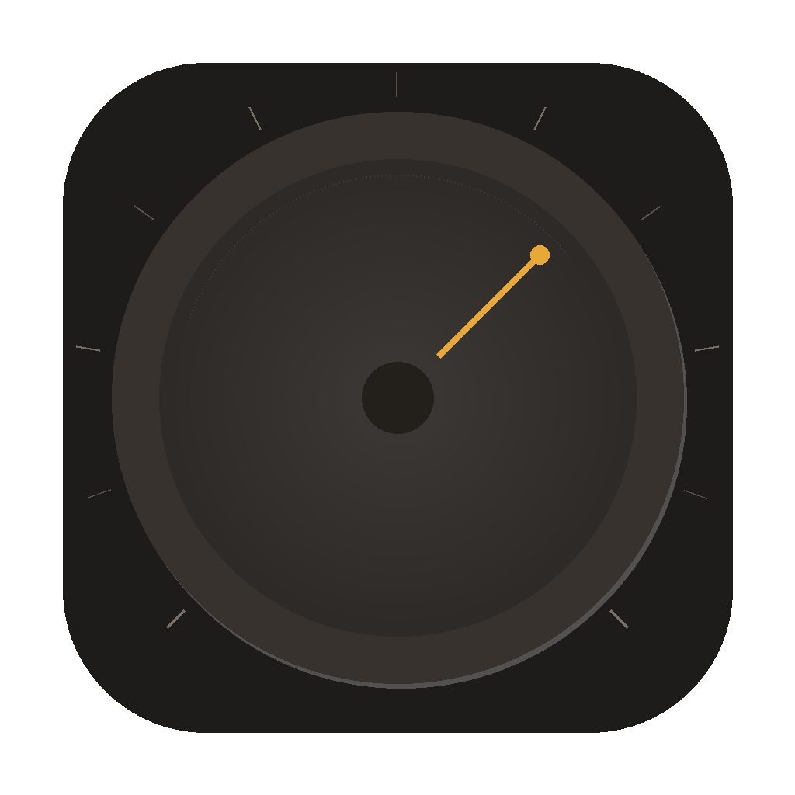

<p align="center">
  
</p>

<h1 align="center">Timbro</h1>

<p align="center">
  <strong>One knob. Five amps. Zero friction.</strong><br>
  A neural amp modeler plugin for macOS with a single rotary control.
</p>

<p align="center">
  
  
  
  
</p>

---

## The idea

Most amp-sim plugins drown you in options. Timbro takes the opposite approach: **a single knob that sweeps from crystal clean to searing lead**. Turn left for sparkle, turn right for fire. That's it.

Under the hood, five [Neural Amp Modeler](https://github.com/sdatkinson/NeuralAmpModelerCore) profiles run in parallel pairs, crossfading seamlessly as you turn the dial. The result is a continuous spectrum of tone — not five presets with hard boundaries.

## Tone map

| Dial | Zone | Character |
|:---:|:---:|:---|
| `0 – 2` | **CLEAN** | Fender Deluxe Reverb '65 — glassy, bell-like cleans |
| `2 – 4` | **WARM** | Two-Rock Studio Signature — singing mid-gain à la John Mayer |
| `4 – 6` | **CRUNCH** | Marshall JTM45 — articulate British crunch |
| `6 – 8` | **DRIVE** | Marshall JCM800 2203 — tight, aggressive midrange |
| `8 – 10` | **LEAD** | Mesa Boogie Mark IV — thick, saturated lead sustain |

Every position between zones blends the two nearest amp models in real time. The crossfade combines a `cos`/`sin` equal-power curve with a `sin(t·π)` perceptual make-up that peaks at +1.5 dB in the middle of the blend, so the perceived loudness stays flat while the timbre morphs smoothly. Position 3.7? That's the upper half of WARM handing over to CRUNCH, with full level all the way through.

## Signal chain

```
Guitar In → Noise Gate → [NAM Zone A ⟷ NAM Zone B] → IR Cabinet → Output Gain → Out
                              ↑ equal-power blend ↑
```

## What's inside

- **Single-knob workflow** — dial in a tone in seconds.
- **Neural amp modeling** powered by NeuralAmpModelerCore (WaveNet, LSTM, ConvNet, Linear architectures all supported).
- **Constant-loudness zone blending** — parallel NAM processing with `cos`/`sin` crossfade plus a perceptual make-up that compensates the harmonic-density dip at the midpoint, so sliding the dial across a zone boundary never thins the volume.
- **Automatic loudness compensation** — every loaded `.nam` profile is normalized to a target of −12 dBFS at load time. Modern profiles use the embedded loudness metadata; legacy profiles without metadata are auto-measured against a deterministic pink-noise calibration signal at the host's sample rate, so any third-party model you drop in plays at a consistent level.
- **Cabinet IR per zone** — `juce::dsp::Convolution` correctly prepared at the host's sample rate before the IR is committed.
- **In-memory model loading** — `.nam` files are parsed straight from binary resources via `nlohmann::json`, no temp-file roundtrip (which silently fails inside the AU sandbox).
- **Vintage analog UI** — walnut & brass aesthetic with VU meter, because tone starts with the eyes.
- **Zero configuration** — every model is bundled. No download, no folder management, no cloud.

## Build

> Requires macOS 12+, CMake 3.22+, and a C++17 compiler.

```bash
# Configure & build
cmake -B build -DCMAKE_BUILD_TYPE=Release
cmake --build build --config Release
```

The AU plugin is automatically installed to `~/Library/Audio/Plug-Ins/Components/Timbro.component`.

**Logic Pro users** — to load unsigned Audio Units:

```bash
defaults write com.apple.Logic10 DoNotValidateAudioUnits -bool YES
```

## Verify the build

A small test executable drives the audio engine directly with a deterministic pink-noise signal and asserts that all five zones produce distinct outputs and that crossfade midpoints stay within 4 dB of the louder endpoint:

```bash
./build/test_dial
```

You should see something like:

```
Zone           Dial   RMS        dBFS
CLEAN          0.0    0.013670   -37.28
clean+warm     1.5    0.016896   -35.44
WARM           2.0    0.019315   -34.28
...
PASS: dial sweep distinct + midpoints within 4 dB
```

You can also run Apple's AU validator:

```bash
auval -v aufx Tmb1 TmbR
```

## Customizing profiles

Swap in your own NAM captures and cabinet IRs:

```
resources/
├── profiles/           # .nam neural amp models
│   ├── clean.nam
│   ├── warm.nam
│   ├── crunch.nam
│   ├── drive.nam
│   └── lead.nam
└── cabinets/           # .wav impulse responses
    ├── clean.wav
    ├── warm.wav
    ├── crunch.wav
    ├── drive.wav
    └── lead.wav
```

Drop your files, rebuild, and you've got a completely different amp collection — still controlled by one knob. Loudness compensation kicks in automatically so you don't have to manually rebalance.

## Architecture at a glance

| Class | Role |
|---|---|
| `Timbro` (`PluginProcessor`) | Main `juce::AudioProcessor`. Owns `ZoneBlender`, the noise gate, and APVTS parameters (dial 0–10, input/output gain, bypass). |
| `ZoneBlender` | Holds 5 `NAMEngine` + 5 `IRLoader` instances. Computes the active zone pair and blend factor from the dial value, runs both engines in parallel, mixes them with an equal-power crossfade plus a `sin(t·π)` perceptual make-up that keeps midpoint loudness flat, then runs the IR cabinet. |
| `NAMEngine` | Wraps `nam::DSP`. Parses `.nam` JSON from memory, applies loudness compensation, and processes mono audio. |
| `IRLoader` | Wraps `juce::dsp::Convolution`. Defers IR commit to `prepare()` so the convolver is correctly initialized at the host sample rate. |
| `TimbroEditor` (`PluginEditor`) | UI with vintage 60s/70s studio gear aesthetic, hosting the main dial, zone label, input/output knobs, bypass, and decorative VU meter. |

## Tech stack

| | |
|---|---|
| **Framework** | [JUCE 8](https://juce.com/) |
| **Neural engine** | [NeuralAmpModelerCore](https://github.com/sdatkinson/NeuralAmpModelerCore) |
| **Math** | [Eigen](https://eigen.tuxfamily.org/) |
| **JSON** | [nlohmann/json](https://github.com/nlohmann/json) |
| **Build** | CMake + [CPM.cmake](https://github.com/cpm-cmake/CPM.cmake) |

## License

MIT — see [LICENSE](LICENSE).

---

<p align="center">
  Built by <a href="https://github.com/tondo-audio">Tondo Audio</a> · Source at <a href="https://github.com/tondo-audio/timbro">tondo-audio/timbro</a>
</p>
